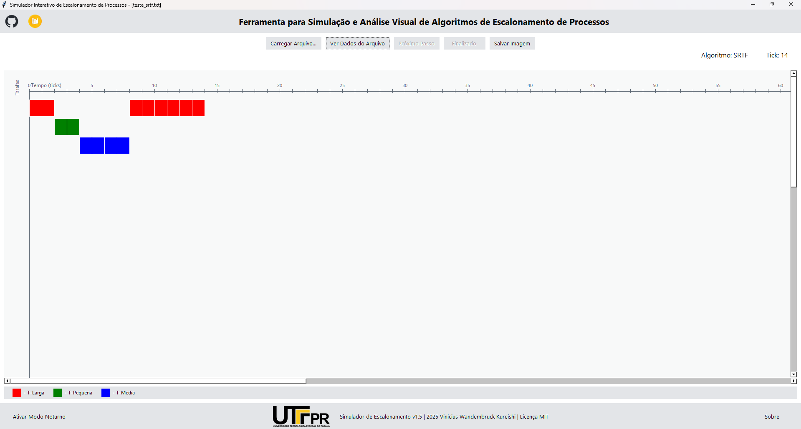

# 🚀 Simulador Interativo de Escalonamento de Processos


Um simulador gráfico interativo de algoritmos de escalonamento de CPU, desenvolvido como projeto para a disciplina de Sistemas Operacionais.



---

## 📝 Descrição

Este projeto implementa um simulador de escalonamento de processos multitarefa preemptivo de tempo compartilhado. Ele permite ao usuário carregar uma lista de tarefas a partir de um arquivo de configuração, executar a simulação passo a passo ou de forma contínua, e visualizar o resultado em um gráfico de Gantt interativo.

O desenvolvimento foi baseado nos requisitos do **Projeto A** da disciplina de Sistemas Operacionais da **UTFPR (2025/2)**, ministrada pelo Prof. Dr. Marco Aurélio Wehrmeister, e utilizando como referência teórica o livro "Sistemas Operacionais: Conceitos e Mecanismos" do Prof. Carlos A. Maziero.

## ✨ Funcionalidades

* **Visualização Gráfica:** Gráfico de Gantt dinâmico que mostra a execução das tarefas ao longo do tempo (ticks).
* **Controle de Simulação:** Execute a simulação tick por tick ("Próximo Passo") ou de forma contínua ("Executar Tudo").
* **Carregamento de Cenários:** Carregue diferentes cenários de escalonamento a partir de arquivos `.txt`.
* **Modo Claro e Escuro:** Interface adaptável com temas claro e escuro.
* **Exportação:** Salve o gráfico de Gantt resultante como uma imagem `.png`.
* **Inspeção de Dados:** Visualize os dados de entrada do arquivo carregado em uma tabela.

## ⚙️ Algoritmos Implementados

O simulador suporta os seguintes algoritmos de escalonamento:

1.  **FIFO (First-In, First-Out)**: Não preemptivo.
2.  **SRTF (Shortest Remaining Time First)**: Preemptivo.
3.  **PRIOP (Prioridade Preemptivo)**: Preemptivo (menor número = maior prioridade).

## 🚀 Como Usar

### 1. (Recomendado) Executável (.exe)

Você pode baixar a versão mais recente pronta para uso na seção **[Releases](https://github.com/KureishiDev/simulador_Escalonamento_SO/releases)** deste repositório.

1.  Baixe o arquivo `main.exe`.
2.  Certifique-se de ter um arquivo de configuração (ex: `entrada.txt`) na mesma pasta.
3.  Execute o `main.exe` e clique em "Carregar Arquivo...".

### 2. A partir do Código-Fonte

Se preferir rodar o projeto localmente:

1.  Clone o repositório:
    ```bash
    git clone [https://github.com/KureishiDev/simulador_Escalonamento_SO.git](https://github.com/KureishiDev/simulador_Escalonamento_SO.git)
    cd simulador_Escalonamento_SO
    ```
2.  (Opcional, mas recomendado) Crie um ambiente virtual:
    ```bash
    python -m venv venv
    source venv/bin/activate  # No Linux/macOS
    .\venv\Scripts\activate   # No Windows
    ```
3.  Instale as dependências:
    ```bash
    pip install -r requirements.txt
    ```
4.  Execute o aplicativo:
    ```bash
    python main.py
    ```

## 📄 Formato do Arquivo de Entrada (`.txt`)

O software carrega os cenários de um arquivo de texto simples. A primeira linha define o algoritmo e o quantum (não utilizado neste projeto, mas presente para futuros algoritmos como Round Robin). As linhas seguintes definem cada tarefa.

**Formato:**
