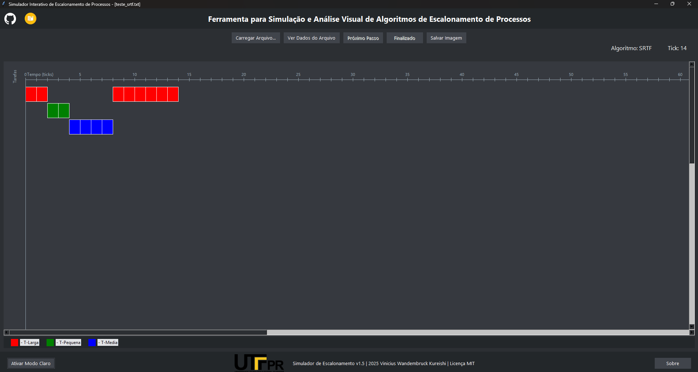

#  Simulador Interativo de Escalonamento de Processos

<p>
  
  
  
  
  
</p>

Um simulador gráfico interativo de algoritmos de escalonamento de CPU, desenvolvido como projeto para a disciplina de Sistemas Operacionais.
Este software é a implementação prática do **Projeto A** da disciplina de Sistemas Operacionais (2025/2), ministrada pelo Prof. Dr. Marco Aurélio Wehrmeister na **Universidade Tecnológica Federal do Paraná (UTFPR)**.



---

##  Descrição

Este projeto implementa um simulador de escalonamento de processos multitarefa preemptivo de tempo compartilhado. Ele permite ao usuário carregar uma lista de tarefas a partir de um arquivo de configuração, executar a simulação passo a passo ou de forma contínua, e visualizar o resultado em um gráfico de Gantt interativo.

O desenvolvimento foi baseado nos requisitos do **Projeto A** da disciplina de Sistemas Operacionais da **UTFPR (2025/2)**, ministrada pelo Prof. Dr. Marco Aurélio Wehrmeister, e utilizando como referência teórica o livro "Sistemas Operacionais: Conceitos e Mecanismos" do Prof. Carlos A. Maziero.

##  Funcionalidades

* **Visualização Gráfica:** Gráfico de Gantt dinâmico que mostra a execução das tarefas ao longo do tempo (ticks).
* **Controle de Simulação:** Execute a simulação tick por tick ("Próximo Passo") ou de forma contínua ("Executar Tudo").
* **Carregamento de Cenários:** Carregue diferentes cenários de escalonamento a partir de arquivos `.txt`.
* **Modo Claro e Escuro:** Interface adaptável com temas claro e escuro.
* **Exportação:** Salve o gráfico de Gantt resultante como uma imagem `.png`.
* **Inspeção de Dados:** Visualize os dados de entrada do arquivo carregado em uma tabela.

##  Algoritmos Implementados

O simulador suporta os seguintes algoritmos de escalonamento:

1.  **FIFO (First-In, First-Out)**: Não preemptivo.
2.  **SRTF (Shortest Remaining Time First)**: Preemptivo.
3.  **PRIOP (Prioridade Preemptivo)**: Preemptivo (menor número = maior prioridade).

##  Como Usar

### 1. (Recomendado) Executável (.exe)

Você pode baixar a versão mais recente pronta para uso na seção **[Releases](https://github.com/KureishiDev/simulador_Escalonamento_SO/releases)** deste repositório.

1.  Baixe o arquivo `main.exe`.
2.  Certifique-se de ter um arquivo de configuração (ex: `entrada.txt`) na mesma pasta.
3.  Execute o `main.exe` e clique em "Carregar Arquivo...".

### 2. A partir do Código-Fonte

Se preferir rodar o projeto localmente:

1.  Clone o repositório:
    ```bash
    git clone https://github.com/KureishiDev/simulador_Escalonamento_SO.git
    cd simulador_Escalonamento_SO
    ```
2.  (Opcional, mas recomendado) Crie um ambiente virtual:
    ```bash
    python -m venv venv
    source venv/bin/activate  # No Linux/macOS
    .\venv\Scripts\activate   # No Windows
    ```
3.  Instale as dependências:
    ```bash
    pip install -r requirements.txt
    ```
4.  Execute o aplicativo:
    ```bash
    python main.py
    ```

##  Formato do Arquivo de Entrada (`.txt`)

O software carrega os cenários de um arquivo de texto simples. A primeira linha define o algoritmo e o quantum (não utilizado neste projeto, mas presente para futuros algoritmos como Round Robin). As linhas seguintes definem cada tarefa.
Há exemplos aqui no repositório de alguns arquivos txt ja preenchidos.
**Formato:**

ALGORITMO;QUANTUM id;cor;ingresso;duracao;prioridade


**Exemplo (`exemplo_srtf.txt`):**
SRTF;1 T1;red;0;5;2 T2;blue;2;2;1 T3;green;3;6;3 T4;orange;5;1;1
## Como Gerar o Executável (Build)

Este projeto utiliza o **PyInstaller** para ser empacotado em um único arquivo `.exe`.

1.  Instale as dependências de build:
    ```bash
    pip install pyinstaller pillow
    ```
2.  Navegue até a pasta raiz do projeto pelo terminal.
3.  Execute o seguinte comando (para Windows):

    ```bash
    pyinstaller --onefile --windowed --icon="icone.ico" --add-data "github-mark-white.png;." --add-data "github-mark.png;." --add-data "todos.png;." --add-data "logo_utf.png;." --add-data "icone_janela.ico;." --hidden-import "Pillow.ImageGrab" main.py
    ```
    
    * `--onefile`: Gera um único arquivo `.exe`.
    * `--windowed`: Remove o console de terminal ao executar o app.
    * `--icon`: Define o ícone do arquivo `.exe`.
    * `--add-data`: Empacota os arquivos de imagem e ícones necessários junto com o app.
    * `--hidden-import`: Garante que a biblioteca `ImageGrab` (usada para salvar a imagem) seja incluída.

4.  O executável final estará na pasta `dist/main.exe`.


##  Tecnologias Utilizadas

* **Python 3**: Linguagem principal.
* **Tkinter**: Para a construção da interface gráfica (GUI).
* **Pillow (PIL)**: Para manipulação e exibição de imagens (ícones, logos) e para salvar o gráfico.
* **PyInstaller**: Utilizado para empacotar o projeto em um único executável (`.exe`).

##  Autor

* **Vinicius Wandembruck - ALUNO DE BSI NA UTFPR** - [GitHub @KureishiDev](https://github.com/KureishiDev)

##  Referências
[PDF de Referência: Sistemas Operacionais (Maziero)](https://wiki.inf.ufpr.br/maziero/lib/exe/fetch.php?media=socm:socm-06.pdf)


Moodle de S.O do Prof. Dr. Marco Aurélio Wehrmeister.

##  Licença

Este projeto é distribuído sob a Licença MIT. Veja o arquivo `LICENSE
